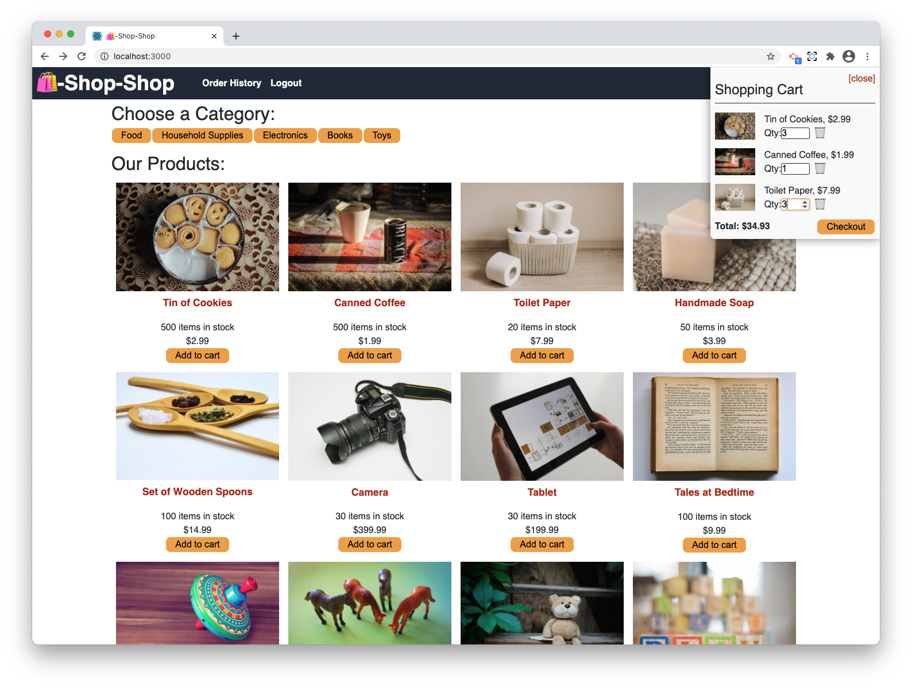

# Shop-Shop-Redux
Refactored MERN app to use Redux to manage state

## Description
This application is an e-commerce site that has been refactored to use Redux for global state control. This is built on the MERN stack and uses stripe for payment processing.

## Link
[Heroku Link](https://dashboard.heroku.com/apps/lit-woodland-67212)

## Screenshot
